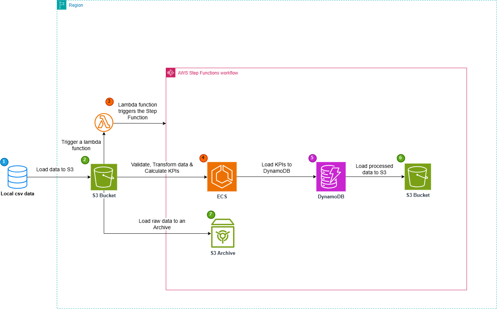

# Real-Time Event-Driven E-Commerce Data Pipeline Documentation

## Overview
This project implements a real-time, event-driven data pipeline for an e-commerce platform. The pipeline is triggered by file uploads to Amazon S3 (using AWS Lambda) and uses Amazon ECS, AWS Step Functions, and DynamoDB to validate, transform, and store data.

---

## Architecture Overview

---

## 1. Data Format and Sample Schema
### Input Format
Files are uploaded to the following S3 paths:
- `raw-data/products.csv`
- `raw-data/orders/*.csv`
- `raw-data/order_items/*.csv`

---

## 2. Validation Rules
### File Presence Validation (Handled by Lambda)
- `products.csv` must exist
- At least one file must exist in `orders/`
- At least one file must exist in `order_items/`

### Content Validation (Handled by ECS Task 1)
- Mandatory fields must be non-null:
   - `order_id`, `user_id`, `created_at` in `orders`
   - `id`, `product_id`, `sale_price` in `order_items`
- price in `products` must be greater than 0 and a float.
- quantity in `order_items` must be greater than 0 and an integer.
- Invalid records are logged and skipped

---

## 3. DynamoDB Table Structure and Access Patterns
### Table Name: `CategoryKPI`
| Partition Key | Sort Key   |     Attributes                                  |
|---------------|------------|-------------------------------------------------|
| category      | order_date | daily_revenue, avg_order_value, avg_return_rate |

#### Access Patterns:
- Query by `category` for a specific date or range of dates.
- Retrieve all orders for a particular day: Query by `order_date`

### Table Name: `OrderKPI`
| Partition Key |      Attributes                                  |
|---------------|-------------------------------------------------------------|
| order_date    | total_orders, total_revenue, total_items_sold, return_rate, unique_customers |

#### Access Patterns:
Query by `order_date` to retrieve all daily KPIs

---

## 4. Step Function Workflow Explanation
### State Machine Flow:
1. **Check File Presence** (Lambda Triggered by S3): 
   - Checks for the presence of `products.csv` and at least one file in `orders/` and `order_items/`
   - Triggered by an S3 PutObject event to the `raw-data/` folder
2. **Task 1 - Validation** (ECS Task via Fargate):
   - Validates schema and cleans data
   - Saves validated data to a `validated/` folder
3. **Task 2 - Transformation** (ECS Task via Fargate):
   - Aggregates, calculates KPIs
   - Saves KPIs to DynamoDB
   - Saves the raw data to an archived folder and the transformed data to a processed folder
4. **Success/Failure Branches**

### Error Handling
- If a task fails due to temporary issues, it is exited
- Failures are logged to CloudWatch

---

## 5. Logging and Monitoring
- **CloudWatch Logs**: All Lambda and ECS logs are tracked here
- **CloudWatch Metrics**: Monitors Step Function states, ECS task success/failure

---

## 6. Instructions to Simulate or Test the Pipeline
### Step-by-Step:
1. **Upload Test Files** to your configured S3 bucket:
   - `products.csv` to `raw-data/`
   - At least one file each in `raw-data/orders/` and `raw-data/order_items/`

2. **Verify Lambda Execution**
   - Check CloudWatch Logs to confirm it validated presence and triggered the Step Function

3. **Monitor Step Function**
   - Go to AWS Step Functions Console
   - Find your execution and inspect the visual workflow for task success/failures

4. **Verify Output**
   - Inspect DynamoDB tables `CategoryKPI` and `OrderKPI` for newly inserted data

---

## 7. Conclusion
This project demonstrates a real-time, event-driven e-commerce data pipeline that leverages AWS Lambda, Amazon ECS, AWS Step Functions, and DynamoDB for efficient data processing and storage.
The solution ensures immediate data validation, transformation, and KPI computation.